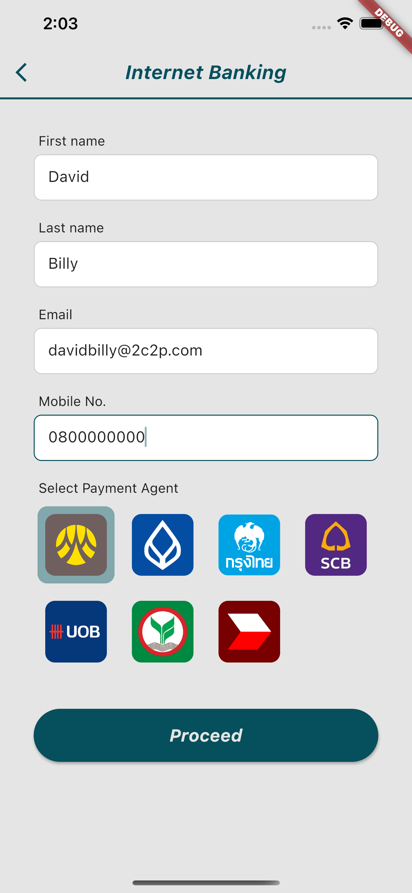
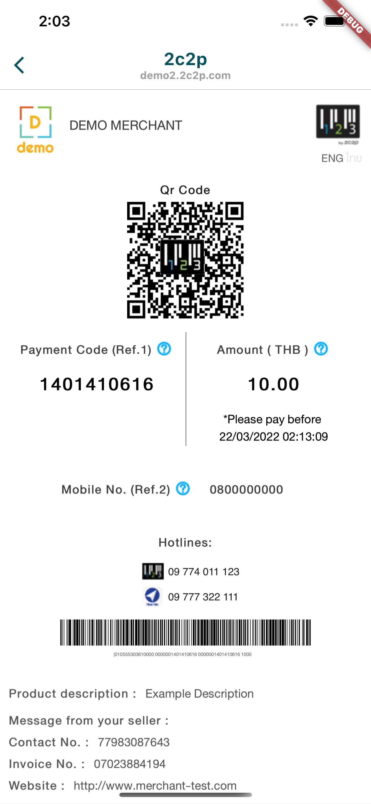

# Internet Banking Feature Example

The 2C2P PGW SDK allows merchants to accept direct debit payments from a customer's preferred bank. This allows for seamless payments in merchants' mobile applications.

## Usage

Selecting the Internet Banking option on the example app will bring you to the input page.

Please fill in all required inputs and select a payment agent, as shown below.

Tap the `Proceed` button to navigate to the transaction page.

You can make a transaction here to complete the payment process.

## Handle Response

See [this](HANDLE_RESPONSE.md)

