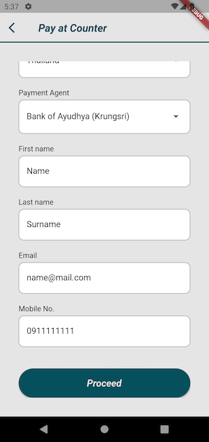
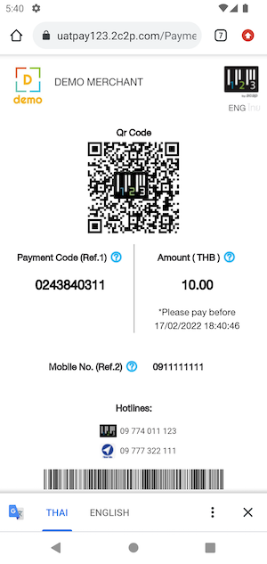

# Pay at Counter Feature Example

Pay at Counter allow customer to generate a payment slips and make payment at the physical counter.

Mobile SDK allow customer to generate payment slips by using your mobile app.

## Usage

Please input all field required on Pay at Counter page.

Then click `Proceed`

The App will bring you to transaction from webview then this step need to pay this transaction to complete process flow.

## Handle Response

See [this](HANDLE_RESPONSE.md)

