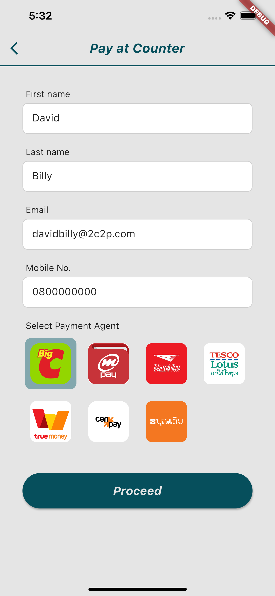
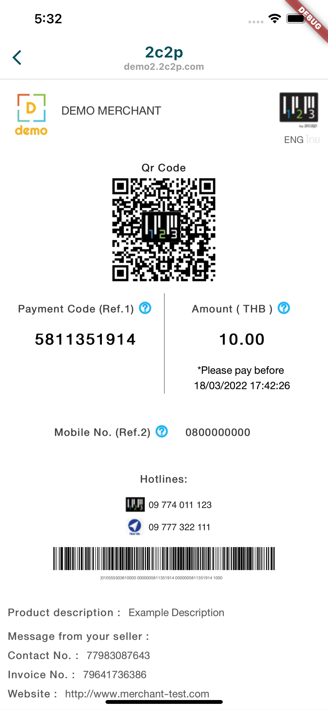

# Pay at Counter Feature Example

The 2C2P PGW SDK allows customers to receive a payment slip through the merchant's mobile application. Customers can then make payments at the merchant's physical counter.

The mobile SDK allows customers to generate payment slips by using a mobile app.

## Usage

Selecting the Over the Counter option on the example app will bring you to the input page. 

Please fill in all required inputs and select a payment agent, as shown below. 

Tap the `Proceed` button to navigate to the transaction page. 

You can make a transaction here to complete the payment process. 

## Handle Response

See [this](HANDLE_RESPONSE.md)

