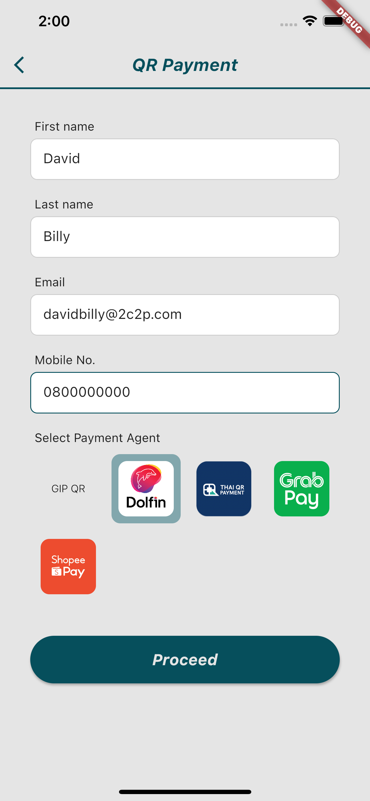

# QR Payment Feature Example

The 2C2P PGW SDK allows customers to scan and pay through a merchant's mobile application.

## Usage

Selecting the QR Payment option on the example app will bring you to the input page.

Please fill in all required inputs and select a payment agent, as shown below.

Tap the `Proceed` button to navigate to the transaction page.

You can make a transaction here to complete the payment process.

## Handle Response

See [this](HANDLE_RESPONSE.md)

