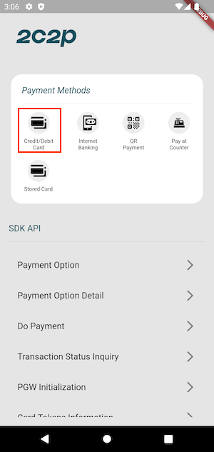
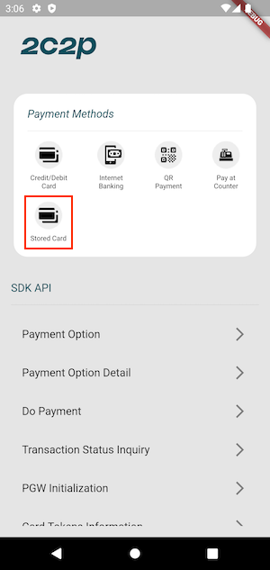
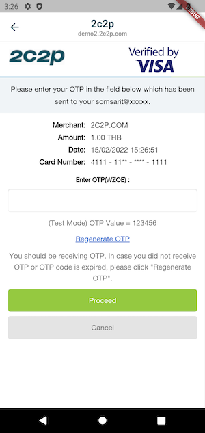

# Stored Card Feature Example

This package has been provide payment features from native SDK. But some function that not implemented yet so developers can checkout this example about exists feature.

## Setup

Before begin, The example app need to setup some information for make a transaction. Please find `ConstantRepository` class and set field from your merchant portal.
- MERCHANT_ID
- SECRET_KEY
- CURRENCY_CODE - This field can change to other code if need.

### Pay with card token (Stored Card)

Please followings this step to use about pay with card token from example.

1. Run example app from project. Then press menu `Credit/Debit Card`.

2. Input card number and other information then check `Save card data for future payments`.
   

3. Press `Proceed` to proceed the transaction.
4. Then after transaction success app will return to home page.
5. This next step will be use previous card to new payment
6. Then press `Stored Card` to proceed a new transaction.
   

7. App will show new transaction without input a card number.
   

## Handle Response

See [this](HANDLE_RESPONSE.md)
